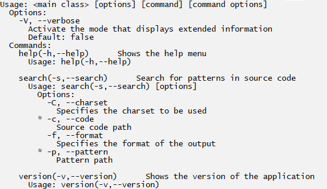

# Source Code Pattern Language(SCPL)

## 1. O que é?

A Source Code Pattern Language é uma linguagem para localização de padrões em código-fonte, e tem como proposta facilitar este processo, provendo uma abstração amigável e simples para o usuário.

## 2. Funcionalidades

Seguindo a proposta da linguagem de simplificar a programação de padrões, a forma de escrita dos padrões da SCPL é baseada na escrita do código-fonte do próprio defeito. Contudo, existem informações dos defeitos que variam entre suas instâncias e precisam ser abstraídas
(nomes, parâmetros, valores e etc), ou até mesmo o defeito pode ser definido pela presença de um trecho de código com a ausência de outro. 

Para viabilizar estes casos, algumas modificações na escrita do código são necessárias, para isso funcionalidades adicionais foram implementadas. A seguir a gente vai apresentar e explicar cada funcionalidade adicional.

### 2.1. Wildcards

Os wildcards, servem como uma palavra abstrata que pode ser usada em certas partes do código do padrão de modo a generalizar a sua busca. Por exemplo, ela pode abstrair nome de
variáveis, nome de métodos, nome de parâmetros e etc. A seguir temos a lista de wildcards disponíveis para o usuário.

| Wildcard | Tipo de Nó |
| --- | --- |
| any | Qualquer um |
| some | Um específico que se repete no padrão  |

Todos os wildcards são prefixos e podem vir seguidos por um sufixo que auxilie na leitura do padrão. O “any” faz referências para qualquer um valor, logo toda comparação que o envolve retorna verdadeiro. O “some” serve para guardar a referência de um nó específico durante a comparação de nós, caso exista mais que um “some” no padrão então ele faz a referência ao mesmo nó. No caso do “some” que faz referência a ocorrências passadas, caso existam referências a mais de uma variável é indispensável o uso do sufixo, pois, é a forma com que a aplicação distingue uma variável de outra.

Olhando o código-fonte 1, na linha 1 e 2 existe um defeito, que ocasiona uma exceção do tipo NullPointerException. A escrita desse defeito utilizando o SCPL pode ser feita copiando exatamente o defeito(código-fonte 2). Entretanto, dessa forma a busca será feita apenas para variáveis com o nome “num” e para o método “toString()”. Outras ocorrências equivalentes do mesmo defeito podem existir, porém, com variáveis e métodos distintos, como no código-fonte 1 (linhas 2-6). Sem o uso dos wildcards o padrão é muito particular e não é possível localizar outras instâncias que fogem um pouco do padrão escrito.

##### Código-Fonte 1: Exemplo de código-fonte para realizar uma busca
```java
1 Integer num = null ;
2 num.toString() ;
3 Integer val = null ;
4 Integer x = null ;
5 x.toString() ;
6 val.hashCode() ;
```

##### Código-Fonte 2: Exemplo de padrão sem utilizar wildcards
```java
1 Integer num = null ;
2 num.toString() ;
```

Usando os wildcards para esses casos, o padrão é definido no código-fonte 3. O “someVariable” é aplicado para guardar a referência a qualquer objeto declarado com valor nulo que em seguida invoca um método e o “anyMethod” para abstrair e indicar que não importa o nome do método. Este novo padrão possibilita ampliar a busca, permitindo que as outras ocorrências do defeito presentes no código-fonte 1 sejam encontradas.

##### Código-Fonte 3: Exemplo de padrão utilizando wildcards
```java
1 Integer someVariable = null ;
2 someVariable.anyMethod() ;

```

### 2.2. Padrões de bloco

O padrão de bloco é um bloco de código com início e fim, que possui o defeito que deseja-se procurar, é equivalente ao conceito de bloco presente nas linguagens de programação. Com esta funcionalidade é possível, por exemplo, utilizar os seguintes blocos: controle de fluxo (“if else”), estruturas de repetição (“for” e “while”), tratamento de exceções (“try and catch”) entre outros. 

O código-fonte 4, apresenta um padrão de bloco “while” no caso de um loop infinito causado por uma variável, representada pelo wildcard “someVar”, que só aumenta com o tempo, o que representa um defeito.

##### Código-Fonte 4: Exemplo de uso do padrão de bloco
```java
1 while ( someVariable > 0) {
2 someVariable ++;
3 }

```

### 2.3. Operador Exists

O Operador Exists tem como função indicar que determinado trecho de código do padrão deve estar presente ou não no código-fonte buscado. Um trecho de código que não deve estar
presente, sempre deve estar relacionado com outro trecho presente, ou seja, não é possível utilizar um padrão apenas composto por blocos não presentes. Quando não informado, por
convenção, todo padrão deve estar presente e para fazer uso do operador exists e sinalizar a presença ou ausência de um bloco de código, são utilizadas as palavras-chave apresentadas na tabela abaixo.

| Palavra-Chave | Significado |
| --- | --- |
| not-exists | Indica o bloco de código que não deve estar presente |
| exists | Indica o bloco de código que deve estar presente  |

Existem duas formas de uso para essas palavras-chave, utilizando comentários ou labels. Os modificadores de existência aplicados em comentários alteram apenas a próxima instrução após o comentário (linha abaixo), suas variações de uso são apresentadas no código-fonte 5. Já para os labels, é possível demarcar blocos de existência, é possível fazer uso de chaves (“{}”) para delimitar os blocos ou aplicar o label diretamente em estruturas permitidas pelo Java (while, for, try e etc), no código-fonte 6 são apresentados exemplos de uso.

##### Código-Fonte 5: Exemplo dos modificadores de existência com comentários
```java
1 // not_exists
2 try {
3   /* exists */
4   Integer.parseInt( any ) ;
5
6 } catch ( anyException any ) {
7
8 }
```
 
##### Código-Fonte 6: Exemplo dos modificadores de existência com labels
```java
1 not_exists:
2 try {
3   exists:{
4     Integer.parseInt( any ) ;
5   }
6 } catch ( anyException any ) {
7
8 }

```

Em ambos os códigos de exemplos, 5 e 6, o mesmo padrão é escrito utilizando as duas formas de aplicação dos modificadores de existência e suas variações. O padrão definido é a
conversão de qualquer valor(wildcard any) para inteiro que não esteja envolvido por um bloco de tratamento de exceções try catch. O bloco “catch” está vazio, pois, o seu conteúdo não importa para o padrão buscado.

No código-fonte 6, o label “not_exist” é utilizado para indicar que todo o bloco try (inclusive o catch) não deve estar presente no código buscado. Como o trecho de código que deve existir está envolvido pelo try é necessário apontar a sua existência, pois, sem uso do modificador de existência o mesmo estaria designado a não existir por estar envolvido pelo try que não existe. A mesma lógica serve para o código-fonte 5, porém, fazendo o uso de comentários, o comentário “//not_exists” aponta que o bloco try não deve existir e o comentário “/\*exists\*/” aponta que a conversão para inteiro deve existir.

### 2.4. Indicação do local do defeito e da mensagem de alerta

O defeito não é inteiramente o padrão de defeito, e sim, os componentes do padrão, o escopo e a sequência de instruções determinam que a presença de determinado trecho de código seja um defeito. Com outras palavras, a execução de um trecho de código dependendo do escopo e dos acontecimentos anteriores, pode provocar um erro, logo, o defeito está presente neste trecho de código e não nos demais componentes do padrão de defeito.

Os elementos do padrão de defeito são importantes para a definição da existência de um defeito, porém, como resultado da busca, é esperado apenas o(s) local(is) passíveis de provocarem um comportamento inesperado. Como exemplo, os padrões dos código-fontes 5 e 6, a execução da instrução correspondente à “Integer.parseInt(any)” por si só não é um defeito, porém, a não existência de um tratamento de exceção try catch ou outros tipos de verificações, determinam que seja.
 
Os padrões programados utilizando a SCPL, permitem a indicação do local exato do defeito e a passagem de uma mensagem de alerta. Para fazer a indicação, basta na linha anterior a instrução adicionar um comentário com a seguinte estrutura: “//Alert: <Mensagem_de_Alerta>” ou “/\*Alert: <Mensagem_de_Alerta>\*/”. Desta forma, apenas as instruções correspondentes à instrução indicada são retornadas.

O código-fonte 7, apresenta a reescrita do padrão do código-fonte 6, indicando a instrução que deve ser retornada e a sua mensagem de alerta. Uma observação, a indicação de retorno e a passagem da mensagem via comentário, implicitamente assinala que o trecho de código deve existir, não sendo necessário utilizar o operador exists.

##### Código-Fonte 7:  Exemplo de indicação do local do defeito e da mensagem de alerta
```java
1 // not_exists
2 try {
3   // Alert : Poss í vel exce ção não tratada
4   Integer . parseInt ( any ) ;
5
6 } catch ( anyException any ) {
7
8 }

```

A indicação mostrada anteriormente é opcional, e compatível com a saída padrão da SCPL. Existe um modo, de formatação de saída que é compatível com a ferramenta SonarQube, onde o resultado já está pronto para ser integrado com o SonarQube. Para o caso da formatação “sonarqube”, a indicação é obrigatória e tem o formato um pouco diferente.

Para o formato de saída sonarqube a indicação é feita da seguinte forma: “//Alert (ruleid=<id>, type=<tipo>, severity=<severidade>, message =<mensagem>)”, também possível via comentário de bloco “/\*\*/”, no qual:
 
* ruleid, corresponde ao id da regra.
* type, corresponde ao tipo de padrão. BUG, VULNERABILITY ou CODE_SMELL.
* severity, corresponde a severidade do padrão. BLOCKER, CRITICAL, MAJOR, MINOR ou INFO.
* message, corresponde a mensagem de erro.

Para as ocorrências do padrão do código-fonte 3 presentes no código-fonte 1, a IDE Eclipse, por exemplo, cria alertas para os trechos correspondentes a instrução “someVariable.anyMethod()” (as linhas 2,5 e 6), com a mensagem “Acesso de ponteiro nulo: a variável <variável> só pode ser nula neste local”. O código-fonte 8, apresenta a reescrita do padrão do código-fonte 3, indicando a instrução que deve ser retornada e sua mensagem de alerta, utilizando o formato “sonarqube”.

##### Código-Fonte 8:  Exemplo de indicação do local do defeito e da mensagem de alerta para o formato sonarqube

```java
1 Integer someVariable = null ;
2 // Alert ( ruleid= 3 , type= BUG , severity= MAJOR , message= Acesso de ponteiro nulo )
3 someVariable.anyMethod() ;
```

#### Alertas para modificadores

No caso dos modificadores, a indicação do local do defeito e a mensagem de alerta, também pode ser feita com outra abordagem. No qual, é escrito o padrão correto juntamente com anotações sobre os modificadores, onde são passados os modificadores corretos e caso no código-fonte não esteja presente algum dos modificadores passados é gerado um alerta. A anotação tem o seguinte formato, prefixo “AlertIfNot” e como sufixo o modificador desejado, ficando no formato “@AlertIfNotPublic”, por exemplo. O nome é intuitivo, traduzindo, tem o seguinte sentido/objetivo: “Se não for public alerta”.

##### Código-Fonte 9:  Exemplo de padrão utilizando o AlertIfNot

```java
public class AnyClass {
@AlertIfNotPrivate (" Message ")
private anyType anyAttribute ;
}
```
##### Código-Fonte 10:   Código-fonte correspondente ao exemplo do AlertIfNot

```java
1 public class Test {
2
3 public Object attribute ;
4 }
```

O código-fonte 9, apresenta um exemplo de padrão escrito utilizando a SCPL que faz uso da anotação AlertIfNot. Um padrão simples de uma declaração de atributo, com qualquer nome, com qualquer tipo e que deve gerar um alerta com a mensagem “Message”, caso o modificador não seja private. O padrão do código-fonte 9 é encontrado no código-fonte 10, todos os nós do padrão possuem nós correspondentes no código-fonte, exceto o modificador do atributo porém o mesmo possui uma anotação de alerta para quando não achar nó correspondente. Dessa forma, quando a cláusula da anotação de alerta é cumprida e todo o restante do padrão é encontrado, o alerta é gerado.

Também é possível passar como argumento da anotação uma string com a mensagem de alerta comum, apresentado no código-fonte 9. Ou com o formato de integração com a ferramento SonarQube, apresentado no código-fonte 11.

##### Código-Fonte 11:   Exemplo de padrão utilizando AlertIfNot com integração com SonarQube

```java
1 @AlertIfNotDefaultAccess (" ruleid= 3 , type= BUG , severity= MAJOR , message= Test ")
2 class AnyClass {
3 }

```

O modificador de acesso default é indicado pela ausência de qualquer um outro modificador de acesso, logo não possui texto. Para utilizar a anotação AlertIfNot e fazer referencia ao modificador de acesso default, o sufixo deve ser “DefaultAccess”, como é empregado no código-fonte 11.

### 2.5. Definição do Escopo da Busca

Conforme já falado, a SCPL define seus padrões através da escrita do próprio defeito. Logo, uma cópia perfeita do defeito é sim um padrão, porém, com um escopo reduzido e engessado. Com a finalidade de definir o escopo da busca e viabilizar uma busca mais generalizada, artifícios foram implementados e requerem algumas modificações no código-fonte. 

Todo padrão escrito utilizando a SCPL é um código-fonte Java válido e não diferente de um código comum, pertencem a um escopo. E se faz necessário definir o escopo em que o padrão pode estar presente, seja em uma classe e/ou método, etc. No entanto, na própria declaração das classes e métodos existem informações variáveis que podem ser generalizadas, e dependendo do padrão não influenciam no resultado.


##### Código-Fonte 12:  Modelo para buscar um padrão que ocorre dentro de um método

```java
@anyModifier
class anyClass {
  @anyModifier
  any anyMethod ( anyType any ) {
    // Insira o padrão aqui
  }
}

```

No código-fonte 12, é apresentado o modelo para buscar um padrão que ocorre dentro de um método. O wildcard any é essencial para generalizar os casos, o mesmo é utilizado para: indicar que a classe e método podem ter qualquer nome, indicar que o retorno do método pode ser de qualquer tipo e indicar que o método pode conter qualquer parâmetro (inclusive nenhum).

Ainda utilizando o any, só que de uma maneira diferente, a generalização dos modificadores é feita através do recurso do Java de anotação. O compilador não permite nenhum modificador diferente dos já existentes, por isso a necessidade de fazer uso desse recurso. Seguindo a mesma  maneira de uso, basta anotar, com uma anotação iniciada por any, o trecho de código o qual deseja generalizar o modificador.

O formato de padrão descrito no código-fonte 12, no qual abstrai a classe e método que envolvem o padrão, é muito útil. Diversos padrões não são influenciados por características da classe ou método que os envolvem. Partindo desse ponto, foi implementada uma abstração que substitui a necessidade de escrever o código presente no código-fonte 12, basta fazer uso do comentário “//InAnyMethod”(como mostrado no código-fonte 13).

##### Código-Fonte 13:  Exemplo de uso da abstração InAnyMethod

```java
// InAnyMethod
// Insira o padrão aqui

```

Traduzindo seu conteúdo, é possível compreender do que se trata o comentário “//InAnyMethod”: “Em qualquer método”. Indicando que todo código abaixo será colocado dentro
de uma abstração de “qualquer método”, que por sua vez está contido de uma abstração de “qualquer classe”. Dessa forma, o padrão presente no código-fonte 13 é equivalente ao padrão presente no código-fonte 12. O pré-processamento da SCPL substitui o comentário “//InAnyMethod” por todo o código necessário para abstrair a classe e método, diminuindo a carga de trabalho para a escrita do padrão.

Utilizando uma ideia similar à do operador not_exists, é possível apontar o modificador o qual a instrução não pode ter. Ao invés de utilizar a anotação “@any”, que aponta qualquer modificador, utiliza-se o prefixo “@not” e o sufixo é o nome do modificador que aquela instrução não deve possuir. O código-fonte 14 apresenta um exemplo.

##### Código-Fonte 14:  Modelo de padrão utilizando o not_exists para modificadores

```java
1 @notAbstract
2 class anyClass {
3   @notPrivate
4   any anyMethod ( anyType any ) {
5     // Insira o padrão aqui
6   }
7 }

```

O código-fonte 14, é uma adaptação do código-fonte 12, onde a classe não pode ser abstrata(“@notAbstract”) e o método não pode ser private(“@notPrivate”). O mesmo processo
pode ser feito para os demais modificadores, basta alterar o sufixo para o nome do modificador desejado.

Vale ressaltar, novamente, que os padrões são códigos-fontes Java e devem respeitar sempre as regras da linguagem. No caso das anotações para modificadores, por exemplo, só é permitido o uso onde é possível(aceito pelo compilador Java) o uso de modificadores(classes, atributos e métodos).

### 2.6. Agrupamento de Padrões por Pastas

Para um determinado padrão de defeito, existem diversas formas de evitá-lo, sendo então necessário durante a busca do mesmo localizar estes códigos de verificação, tornando a localização mais precisa. Porém, a programação de múltiplas verificações em um só arquivo de código-fonte de padrão, pode deixar a sua escrita complexa ou até mesmo inviável. Pensando nesses casos, foi implementado o agrupamento de padrões por pastas, onde um grupo de padrões pertencentes a uma pasta constituem um defeito. Sendo possível trabalhar com a ideia de conjuntos, e incluir ou excluir do resultado final da busca de todo defeito(pasta), a ocorrência de determinado padrão.

Voltando ao padrão do código-fonte 3, apenas o mesmo não é o suficiente para determinar se existe um defeito ou não, pois, algumas verificações não são feitas. Por exemplo, não é verificado se entre a declaração nula e a chamada de método, existe uma atribuição alterando o valor nulo da variável. Ou se antes da chamada do método existe uma verificação para que o método só seja invocado, caso a variável tenha valor diferente de nulo e assegurar que o valor não é nulo.

Esses casos citados anteriormente não se configuram defeitos e não devem ser considerados no resultado final da busca, ou seja, devem ser excluídos. Por regra, todo padrão deve ser incluído ao resultado final, e para marcar um padrão como exclusão, basta adicionar o sufixo Exclude ao nome de seu arquivo, assim deve ser terminado com Exclude.java.

Os padrões de exclusão trabalham como exceções a regra dos padrões de inclusão, se um nó é retornado para o padrão do código 3 o mesmo é incluído ao resultado, porém, se o mesmo
também for retornado para o padrão do código-fonte 15 ou 16, deve ser retirado. Para o exemplo atual, uma variável declarada com valor nulo e posteriormente uma chamada de método com a mesma, não é um defeito caso: haja uma outra atribuição de qualquer valor antes da chamada de método (código-fonte 15) ou exista uma verificação de que o valor é diferente de nulo (código-fonte 16).

##### Código-Fonte 15: Exemplo de padrão de exclusão

```java
// Terminado com ’Exclude . java ’
Integer someVariable = null ;
someVariable = anyValue ;
someVariable.anyMethod () ;
```
 
##### Código-Fonte 16: Exemplo de padrão de exclusão

```java
// Terminado com ’Exclude . java ’
Integer someVariable = null ;
if( someVariable != null )
 someVariable . anyMethod () ;

```

#### Alternativa ao agrupamento de padrões por pastas

O agrupamento de padrões por pastas facilita a programação de padrões compostos por múltiplos sub-padrões, porém adiciona o trabalho de criar novos arquivos, demandando um esforço maior. Muitas das vezes esses novos arquivos repetem código-fonte e diferem em apenas um pequeno trecho. Pensando nesses casos, foi implementada uma funcionalidade de marcação no código-fonte do padrão, no qual possibilita escrever as múltiplas variações do padrão que diferem em apenas um ponto todas no mesmo arquivo.

O bloco de opções tem início com o comentário “//#BEGIN”, as opções são separadas pelo comentário “//#OR” e o bloco é finalizado com o comentário “//#END”, como utilizado no
código-fonte 17. Para cada opção é gerado automaticamente, em memória, um novo arquivo de código-fonte, repetindo o código-fonte do padrão substituindo o bloco de opções inteiro apenas pelo termo da respectiva opção. O funcionamento é análogo a propriedade distributiva, presente na operação matemática de multiplicação.


##### Código-Fonte 17: Alternativa ao agrupamento de pastas

```java
// InAnyMethod
//# BEGIN

someVariable = anyMethod() ;
if( someVariable != null ){
 someVariable.any() ;
}

//#OR

anyType someVariable = null ;
// not_exists
someVariable = any ;
someVariable.any() ;

//#END


```
O código-fonte 17 apresenta uma aplicação do bloco de opções. Onde se deseja procurar dois padrões que não dependem de características da classe e método que os evolvem, para isso foi utilizado o comentário “//InAnyMethod”. O bloco de opções facilita e possibilita a escrita dos padrões em apenas um arquivo. A junção destas duas funcionalidades deixa o padrão bem reduzido, sendo é possível notar que o foco principal de esforço é apenas nos pequenos trechos principais dos padrões.

## 3. Manual do Usuário

### 3.1. Requisitos para usar a ferramenta
Para executar a ferramenta é necessário possuir o ambiente de execução Java (JRE) na versão igual ou superior a 13.0.1. Além disso, deve-se ter conhecimento básico de programação Java, para realizar a programação dos padrões e utilizar todas as suas funcionalidades.

### 3.2. CLI (Command User Interface) - Prompt de Comando

O CLI é a interface utilizada pela ferramenta para interagir com o usuário, onde o mesmo através de comandos executa as ações desejadas no sistema.  
A ferramenta deve ser executada via Prompt de Comando passando os comandos abaixo :

```
java -jar scpl.jar <comandos_CLI>
```

  * "java" faz referência ao JRE(caso não esteja no path do sistema operacional, é necessário especificar o caminho completo do arquivo)
  * "scpl.jar" representa a aplicação já compilada 
  * “<comandos_CLI>” representa os comandos que serão passados para o sistema interpretar e executar ações. 

Para todas as seções abaixo, a parte da execução do arquivo “.jar” (java -jar scpl.jar), que já é de conhecimento dos desenvolvedores Java, será tratada como “\<main class\>”.

#### 3.2.1. Comandos CLI

##### Help
O comando help é comum em aplicações CLI e tem como função ajudar o usuário. Sua execução apresenta um menu com todas as possibilidades de comandos aceitos pela aplicação,
o que auxilia o usuário na formulação correta de comandos para a aplicação. A figura abaixo, apresenta a saída da aplicação após a execução do comando “help”.

###### Menu help CLI


Para executar a função help basta passar o comando “\<main class\> help”, a instrução “help” pode ser substituído por uma das flags: “-h” ou “–help”. Abaixo mostra o uso do comando.  
   
###### Comando Help
```
 java -jar scpl.jar -help
```

##### Search
O comando search executa a função principal da aplicação, o mesmo realiza a busca de padrões em código-fonte. Esta função é executada utilizando o comando “\<main class\> search
\[opções\]”, a instrução search pode ser substituída pelos flags: “-s” ou “search”. Este comando necessita de parâmetros que são passados pelas opções e algumas delas são obrigatórias, são elas:

* “-c” ou “–code”, especifica o caminho do código-fonte alvo da busca. (Obrigatório)
* “-p” ou “–pattern”, especifica o caminho do padrão buscado. (Obrigatório)
* “-C” ou “–charset”, especifica o charset que será usado pelo compilador. (Opcional)
* “-f” ou “–format”, especifica o formato de saída da busca. (Opcional)

As opções, “–code” e “–pattern”, são as únicas obrigatórias e sem elas não existem a busca. Ambas apontam para caminhos de arquivos, e podem apontar tanto para um arquivo específico ou para uma pasta. Para o código-fonte, todo o caminho é percorrido e todos os arquivos de código-fonte Java (terminados com “.java”) encontrados são carregados em memória e armazenados em uma só lista de arquivos. No caso dos padrões o mesmo é feito, porém, os padrões são armazenados em diversas listas associadas as suas pastas de origem, respeitando a hierarquia das pasta e permitindo que o agrupamento de padrões por pastas seja feito.

A aplicação sempre tenta inferir o charset para o compilador utilizar durante a extração da AST do código-fonte, porém, quando não consegue, o charset utilizado é o padrão do compilador. Em alguns casos, isto pode gerar erros e, apesar de ser um parâmetro opcional, informar o charset passa a ser necessário.

A opção format foi implementada pensando na facilidade de integração com outras plataformas, onde é possível escolher o formato de saída da busca. Quando não informada, a saída
é feita da forma padrão desenvolvida na SCPL. Até o momento, apenas um formato foi implementado, que é o formato de integração com a ferramenta SonarQube, para utilizar basta
utilizar a opção format com o valor “sonarqube”. 
 
Abaixo mostra o uso do comando principal e em seguida o comando com todas as opções. 

###### Comando Search padrão
 ``` 
 java -jar scpl.jar search -code ./CaminhoCodigoAlvoDaBusca -pattern ./CaminhoCodigosDosPadroes 
 ```
###### Comando Search com todas as opções
 ``` 
 java -jar scpl.jar search -code ./CaminhoCodigoAlvoDaBusca -pattern ./CaminhoCodigosDosPadroes –charset UTF-8 –format sonarqube
 
 ```

##### Version

O comando version é um comando simples, tem como resultado a apresentação da versão da SCPL em execução. É útil para o usuário ter conhecimento exato de qual versão da aplicação
está utilizando. Sua execução deve ser feita utilizando o comando abaixo: 

###### Comando Version

 ```
 java -jar scpl.jar -version 
 ```
 
A instrução “version” pode ser substituído por uma das flags: “-v” ou “–version”. 

##### Debug

A opção debug foi implementada para complementar o comando search, adicionando informações relacionadas a busca, possibilitando a depuração do sistema. Está funcionalidade é
importante no processo de desenvolvimento dos padrões de código-fonte utilizando a SCPL, pois auxilia o desenvolvedor a entender o funcionamento e ajustar o padrão conforme desejado. Para ativar este modo basta adicionar uma das flags: “-d” ou “–debug”, juntamente com as instruções para a busca desejada. O uso desse comando está abaixo:

###### Comando Debug

 ``` 
 java -jar scpl.jar -debug search -code ./CaminhoDoCodigoAlvoDaBusca -pattern ./CaminhoComCodigosDosPadroes
 ```
 
Esta opção funciona da seguinte forma, as ASTs do código-fonte alvo e do padrão são apresentadas linha a linha de forma indentada, juntamente com os seus trechos de código correspondentes. Assim, sendo possível enxergar o formato das árvores geradas pelos elementos da busca. Há uma diferença para a AST do código-fonte, os nós que possuem nós correspondentes na AST do padrão são marcados com o prefixo “##”, indicando que foram encontrados na busca.

##### Código-Fonte 18: Exemplo de código-fonte

```java
1 public class Codigo {
2   public static void run () {
3     doSomething() ;
4     String str = "SCPL";
5
6     System.out.println(str);
7   }
8 }
```

##### Código-Fonte 19: Exemplo de padrão

```java
1 @anyModifier
2 class anyClass {
3   @anyModifier
4   anyType anyMethod () {
5     // Alert : Teste
6     System.out.println(any) ;
7   }
8 }

```

Dado o exemplo de busca com os códigos-fontes apresentados acima, em que se deseja encontrar o padrão (código-fonte 19) no código-fonte 18. Utilizando a opção debug para a
busca, a saída apresentada pelo sistema para a AST do código-fonte 18 é apresentada abaixo:

##### Resultado padrão do debug

```
Codigo.java (CompilationUnitTree)
  ##public class Codigo { (ClassTree) L: 1 C: 1 -> L: 8 C: 2
    ##public (ModifiersTree) L: 1 C: 1 -> L: 1 C: 7
    ##public static void run() (MethodTree) L: 2 C: 3 -> L: 7 C: 4
      ##public static (ModifiersTree) L: 2 C: 3 -> L: 2 C: 16
      ##void (PrimitiveTypeTree) L: 2 C: 17 -> L: 2 C: 21

      ##{ (BlockTree) L: 2 C: 28
        ##doSomething(); (ExpressionStatementTree) L: 3 C: 5 -> L: 3 C: 19
          doSomething() (MethodInvocationTree) L: 3 C: 5 -> L: 3 C: 18
            doSomething (IdentifierTree) L: 3 C: 5 -> L: 3 C: 16
        String str = "SCPL" (VariableTree) L: 4 C: 5 -> L: 4 C: 23
          String (IdentifierTree) L: 4 C: 5 -> L: 4 C: 11
          "SCPL" (LiteralTree) L: 4 C: 16 -> L: 4 C: 22
        ##System.out.println(str); (ExpressionStatementTree) L: 6 C: 5 -> L: 6 C: 27
          ##System.out.println(str) (MethodInvocationTree) L: 6 C: 5 -> L: 6 C: 26
            ##System.out.println (MemberSelectTree) L: 6 C: 5 -> L: 6 C: 23
              ##System.out (MemberSelectTree) L: 6 C: 5 -> L: 6 C: 15
                ##System (IdentifierTree) L: 6 C: 5 -> L: 6 C: 11
            ##str (IdentifierTree) L: 6 C: 24 -> L: 6 C: 25
       ##} L: 7 C: 4
##} L: 8 C: 2

```
A opção debug possui parâmetros adicionais, responsáveis por ajustar o que é exibido na apresentação da AST do código-fonte. As flags: “-l” ou “–showLocation” são utilizadas para indicar se será exibido as informações de localização dos nós(linha e coluna), possui um valor do tipo booleano com valor padrão verdadeiro. Também é possível determinar o intervalo das linhas que serão apresentadas, sendo útil para casos onde o código-fonte é extenso e deseja-se focar em uma específica faixa do código-fonte.

Para apontar a linha inicial basta utilizar uma dasflags “-b” ou “–beginLine”, indicando o número da linha desejada. Já para a linha final, deve ser usada uma das flags “-e” ou “–endLine”, seguido do número da linha final. Não é obrigatório o uso simultâneo das duas flags, ou seja, é possível indicar apenas a linha inicial ou apenas a linha final.

Um exemplo de aplicação dos parâmetros adicionais para o exemplo anterior, seguiria o seguinte formato de instrução para a linha de comando: 

###### Comando Debug com parâmetros adicionais

 ``` 
 java -jar scpl.jar —debug -l=false –beginLine=3 –endLine=6 search -code ./CaminhoDoCodigoAlvoDaBusca -pattern ./CaminhoComCodigosDosPadroes
 ```
 
Onde, “-l=false” desativa a apresentação das informações de localização e as instruções “–beginLine=3” e “–endLine=6” indicam a linha inicial e final, respectivamente. A execução do comando apresentado anteriormente tem o seguinte resultado:

##### Resultado do debug com parâmetros adicionais
```
Codigo.java (CompilationUnitTree)
  ##doSomething(); (ExpressionStatementTree)
    doSomething() (MethodInvocationTree)
      doSomething (IdentifierTree)
  String s = "SCPL" (VariableTree)
  (ModifiersTree)
    String (IdentifierTree)
    "SCPL" (LiteralTree)
  ##System.out.println(s); (ExpressionStatementTree)
    ##System.out.println(s) (MethodInvocationTree)
      ##System.out.println (MemberSelectTree)
        ##System.out (MemberSelectTree)
          ##System (IdentifierTree)
      ##s (IdentifierTree)

```

##### Verbose

A opção verbose tem como função ativar um modo estendido de informações, um modo verboso onde as informações sobre os processos que estão sendo realizados são apresentadas
para o usuário. Está opção pode ser usada juntamente de todos os comandos, e para ser usado deve ser informado antes dos comandos. O seu uso é feito utilizando as flags “-V” ou “verbose”, a instrução fica da seguinte forma:

###### Comando Verbose

 ```
 java -jar scpl.jar -verbose search -code ./CaminhoDoCodigoAlvoDaBusca -pattern ./CaminhoComCodigosDosPadroes
 ```

### 3.3. Passagem de Parâmetros Alternativa

A passagem de múltiplas instruções via linha de comando, pode se tornar uma tarefa verbosa, sem contar o fato de ter que reescrever todas as instruções novamente a cada execução. Mediante a esse fato, a biblioteca utilizada pelo CLI provê a possibilidade de passar os argumentos para aplicação através de arquivos de texto.

Desse modo, as instruções que serão passadas ficam organizadas e armazenadas em um arquivo “.txt”. No qual, cada linha do arquivo representa uma instrução, deixando as instruções visualmente mais organizadas. O usuário tem a chance de editar previamente o arquivo e também reexecutar uma sequência de instruções, sem a necessidade de reescrever cada uma delas. Abaixo é apresentado um arquivo texto de exemplo.

###### Exemplo de um arquivo texto que usa os comandos da CLI  

 ```
 --verbose
search
-c
Codigo.java
-p
Padrao.java
--charset
UTF-8

 ```

Para utilizar essa forma de passagem de comandos, basta na linha de comando executar o seguinte comando. 

###### Comando que utiliza um arquivo texto que usa os comandos da CLI   

 ```
 java -jar scpl.jar @argumentos.txt 
 ```

No qual, “argumentos.txt” faz menção ao arquivo de texto que contem as instruções. De forma resumida, basta passar a instrução “@” juntamente do caminho do arquivo de texto.


